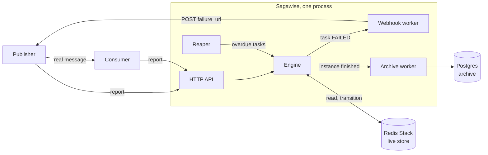
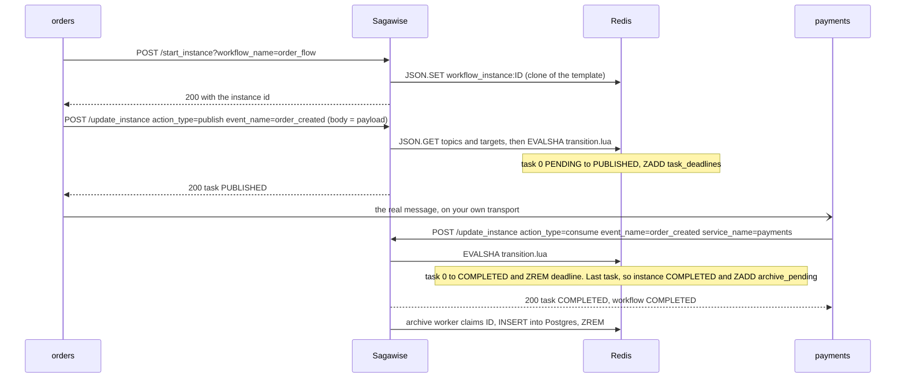
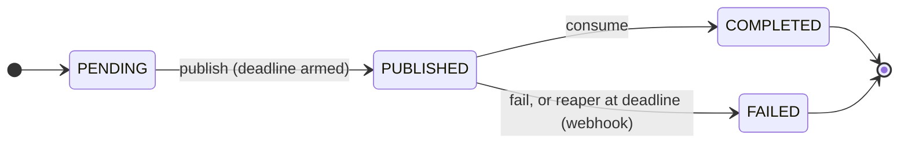

# Architecture

Read this if you are new to the code and already know the [concepts](concepts.md). It names every moving part, where it lives, and what it owns. The exact rules each part must obey are in the [contract](contract.md).

## Beginner reading order

The page is ordered for someone who knows the code. If you do not, read it in this order:

1. The paragraph and figure under [Components](#components), skipping the table.
2. [One saga's life](#one-sagas-life): watch one order go through every box in the figure, then read how the failure path differs.
3. [State machines](#state-machines): the states you just saw, named.
4. [Data](#data): what those steps wrote in Redis and Postgres.
5. The Components table, now that the file names mean something.
6. The rest is reference. Read it when you touch that part.

## Components

Sagawise is one process. Your services send it reports over HTTP. Every report ends in the **Engine**, which reads and writes the instance in Redis. When an instance finishes, the Engine puts it on a queue and the **Archive worker** copies it into Postgres. When a task fails, the Engine puts it on another queue and the **Webhook worker** calls the publisher's failure URL. The **Reaper** feeds the Engine too: once a second it looks for tasks whose deadline has passed and fails them. Metrics are served on a separate port.



| Part | Code (file, entry point) | Owns |
| --- | --- | --- |
| HTTP API | [`backend/main.go`](https://github.com/venturenox/sagawise/blob/main/backend/main.go) `main`, `handler`; [`backend/httpsec`](https://github.com/venturenox/sagawise/tree/main/backend/httpsec) | Routes, middleware (body cap, CORS, API keys, access log), probes, graceful shutdown. Plain `net/http`, no framework. |
| Engine | [`backend/instance_engine/engine.go`](https://github.com/venturenox/sagawise/blob/main/backend/instance_engine/engine.go) `Engine`, `New`; [`instance_engine.go`](https://github.com/venturenox/sagawise/blob/main/backend/instance_engine/instance_engine.go) `StartInstance`, `UpdateInstance` | Every dependency in one struct: Redis client, Postgres pool, clock, service registry, webhook HTTP client, the two workers, logger, metrics. No package-level state, no detached goroutines. |
| Transition script | [`backend/instance_engine/transition.lua`](https://github.com/venturenox/sagawise/blob/main/backend/instance_engine/transition.lua), called from `Engine.transition` | The state machine. One script call checks the task's state, writes the new state, arms or removes the deadline, finishes the instance if needed and queues the archive or webhook, so concurrent reports cannot interleave. |
| Reaper | [`backend/instance_engine/reaper.go`](https://github.com/venturenox/sagawise/blob/main/backend/instance_engine/reaper.go) `StartDeadlineReaper` | Ticks every second, fails overdue tasks through the same script. |
| Workers | [`backend/instance_engine/queue.go`](https://github.com/venturenox/sagawise/blob/main/backend/instance_engine/queue.go) `Worker.Start` | Drain the archive and webhook queues with leases and backoff. |
| Templating | [`backend/templating`](https://github.com/venturenox/sagawise/tree/main/backend/templating) `ParseDSL`, `Validate` | Loads and validates the workflow DSL at startup, creates the RediSearch indexes and the Postgres table. |
| Observability | [`backend/logging`](https://github.com/venturenox/sagawise/tree/main/backend/logging) `Middleware`; [`backend/otel`](https://github.com/venturenox/sagawise/tree/main/backend/otel) `Setup`; [`instance_engine/metrics.go`](https://github.com/venturenox/sagawise/blob/main/backend/instance_engine/metrics.go); [`health.go`](https://github.com/venturenox/sagawise/blob/main/backend/instance_engine/health.go) `Liveness`, `Readiness` | Structured logs with a request logger in the context, OpenTelemetry metrics exported to Prometheus, liveness and readiness. |
| Webhook signing | [`backend/webhooksig`](https://github.com/venturenox/sagawise/tree/main/backend/webhooksig) `Sign`, `Verify` | HMAC headers on failure webhooks, verifier shared with the SDKs. |

Redis is the live store and the only place state changes happen. Postgres is an archive of finished instances, written after the fact. If Postgres is down the API keeps working and archives queue up in Redis; if Redis is down nothing works and readiness says so.

## Data

All live state is in Redis Stack (RedisJSON + RediSearch). A zset is a Redis sorted set: unique strings, each with a number, kept ordered by that number, so "every member with a number below now" is one command. The three zsets below are each one set for the whole system, across every instance.

| Key | Type | Content |
| --- | --- | --- |
| `workflow_template:<name>` | JSON | A workflow from the DSL, written at startup. |
| `workflow_instance:<id>` | JSON | One run of a workflow (layout below). `<id>` is a random 20-character string. |
| `task_deadlines` | zset | member `<id>:<index>`, score = deadline in unix ms. A task is here exactly while it is PUBLISHED. |
| `archive_pending` | zset | member `<id>`, score = when to try. Instances that reached a terminal state and are not yet in Postgres. |
| `webhook_pending` | zset | member `<id>:<index>`, score = when to try. FAILED tasks whose publisher has not been told. |
| `archive_attempts`, `webhook_attempts` | hash | member → attempts so far, for backoff. |
| `index_schema:<name>` | string | Hash of a RediSearch index schema; the index is recreated when the code's schema differs. |

An instance document, abbreviated:

```json
{"schema": 2, "name": "order_flow", "state": "PENDING",
 "startedAt": 1757030400, "completedAt": 0, "failedAt": 0,
 "tasks": [
   {"topic": "order_created", "from": "orders", "to": "payments", "timeout": 20000,
    "state": "PUBLISHED", "publishedAt": 1757030401, "consumedAt": 0, "failedAt": 0,
    "payload": {"order_id": 42}}
 ]}
```

A task's identity is its index in `tasks`, the same as in the DSL. The `workflows_index` RediSearch index names explicit paths only (`$.tasks[*].topic`, never `$..`), so payload fields are never indexed and cannot be searched or matched by mistake.

Postgres has one table, `instance_history` (`id`, `name`, `startedAt`, `completedAt`, `instance_data` JSON), with a unique constraint on `id` so archiving is idempotent.

## One saga's life



Had `payments` stayed silent, the reaper would have run the same script with action `reap` after 20 s: task 0 to FAILED, instance to FAILED, `webhook_pending` gets `<id>:0`, and the webhook worker POSTs the stored payload to the `failure_url` registered for `orders`.

A report is a straight line: parse the query parameters, resolve the target task in Go by string equality on the document's topics and targets (one `JSON.GET`), run the script, map its result code to an HTTP status and JSON body, nudge the worker if the script enqueued something.

Why the state change is a script and not Go: a state change is a check followed by a write. From Go those are two Redis commands with a gap between them, and in that gap Redis serves other callers. A late consume and the reaper could both read PUBLISHED, both pass the check, both write. Redis runs a script to completion before it takes the next command, so inside the script the check and the write are one operation: the second caller sees the first caller's write and is refused. The rule follows: a single command is done from Go, and any sequence of commands that must all see the same state is done in the script.

## State machines



An instance is PENDING until its last task is COMPLETED (then COMPLETED) or any task is FAILED (then FAILED). Both are terminal and reject every further state change. When an instance fails, its other tasks freeze where they are and their deadlines are removed, so there is one failure and one webhook per instance. Every other rule, including how duplicates and `is_retry` behave, is in the [contract](contract.md).

## Background loops

| Loop | Interval | Work | Durability |
| --- | --- | --- | --- |
| Reaper | 1 s | Up to 1000 overdue members of `task_deadlines`, failed in one script call. | Marking FAILED and removing the deadline happen in the same step; a Redis error leaves the deadline for the next tick. |
| Archive worker | 1 s, nudged after each terminal transition | Insert the instance document into Postgres. | Retries forever, 1 s doubling, capped at 30 s. |
| Webhook worker | 1 s, nudged after each failure | POST the task payload to the publisher's `failure_url`, 16 in parallel, 5 s per attempt. | 2 s tripling, capped at 5 min, 8 attempts, then logged and counted. Delivery never changes state. |

Both workers use the same queue pattern: claim every due member by moving its score to `now + 30 s` (a lease), run the job, `ZREM` on success or reschedule with backoff. A worker that dies mid-job hands the job back when the lease expires. Consumers are idempotent, so the guarantee is at-least-once. Each loop records a heartbeat; the liveness probe reports a loop silent for 30 s as stalled.

## Process lifecycle

Startup, in order, each step fatal on failure: read and check configuration; install the OpenTelemetry providers; connect Redis and Postgres; load, validate and store every DSL file, ensure indexes and the archive table; build the Engine; check every publishing service has a `failure_url`; load the Lua scripts; check Redis has AOF persistence; start the reaper and workers; listen on the API and metrics ports.

Shutdown on SIGTERM or SIGINT: stop accepting requests and let in-flight handlers finish (10 s), stop the reaper, stop the workers (in-flight jobs finish under their own timeouts), close the clients. Anything still queued stays leased in Redis and resumes on the next start.

Request middleware, outermost first: OpenTelemetry HTTP metrics, access log and request logger, body size cap, CORS allowlist, API key check, router. Probes skip the key check.

## Boundaries worth knowing

- The DSL files and `services.json` are baked into the image. Changing a workflow means a rebuild.
- One Sagawise process per Redis is what is tested. The atomicity rules make several replicas possible; nothing verifies it yet.
- Redis must run with AOF. Deadlines and queues live only there, and the process refuses to start otherwise (`SAGAWISE_REDIS_AOF`).
- Archived documents stay in Redis. Nothing evicts them.
