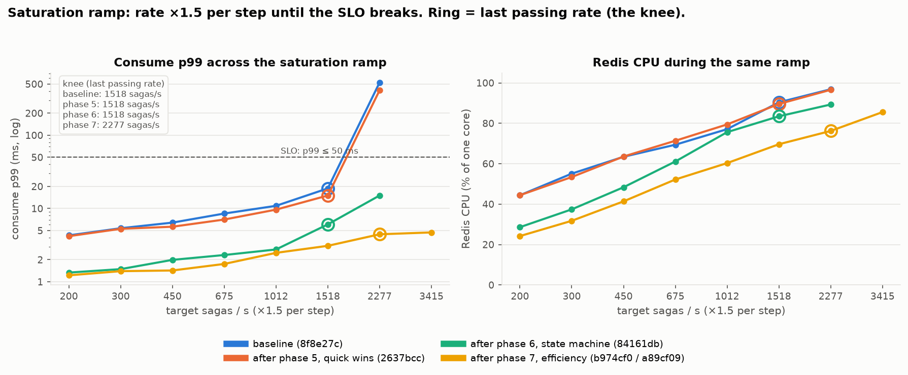
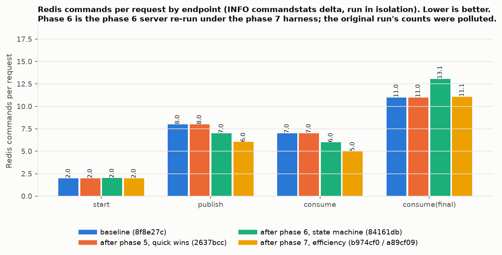
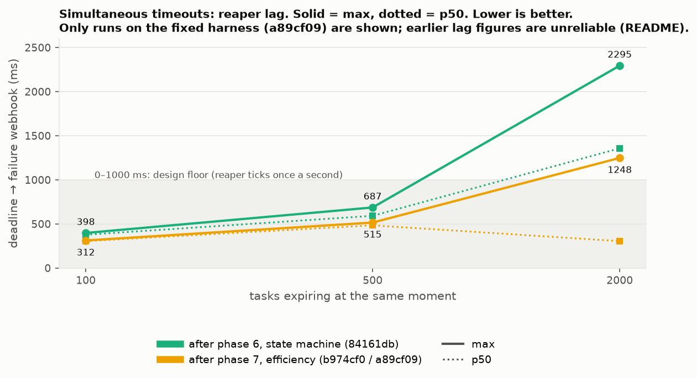
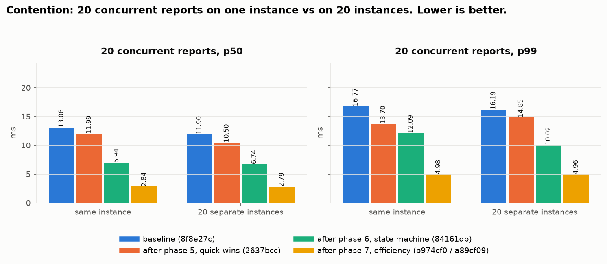

# Benchmarks

Read this before claiming a performance change, or when you want numbers. The method and the tooling are here; the raw data lives in `benchmarks/` at the repository root: one directory per run under `runs/`, never overwritten, comparison reports under `comparisons/`, and `plot.py`, which redraws the charts below.

## Running

```bash
make bench BENCH_LABEL=<label>            # ~5 min, one run directory
make bench-profile BENCH_LABEL=<label>    # ~10 min, bottleneck hunt
make bench-compare A=runs/<a> B=runs/<b>  # A = before, B = after
```

Redis and Postgres from `make start` must be running. Both `bench` targets stop the `sagawise` container for the duration, because its reaper shares `task_deadlines` with the server under test and would steal the timeouts, then start it again. `BENCH_ARGS` tunes a run, for example `BENCH_ARGS="-rates 50 -duration 5s -lag-tasks 50 -skip-gobench"` for a quick check. `bench-compare` needs `benchstat` on the path (`go install golang.org/x/perf/cmd/benchstat@latest`).

Every run directory holds `report.md` (human-readable), `load.json` or `profile.json` (machine-readable, the input to `compare`), `go-bench.txt` (raw `go test -bench` output) and `env.txt` (machine, versions, commit, configuration). Runs from different machines are flagged by `compare`; do not compare them.

## What `bench` measures

The runner in `backend/cmd/bench` builds the real server binary, launches it on a free port against the local stores with its own workflow and its own webhook receiver, and drives it over HTTP.

- **Load.** Sagas started open-loop at fixed rates (default 50, 100 and 200 per second, 20 s each). One saga is five requests on a two-task workflow: start, publish, consume, publish, consume. Per endpoint: p50, p95, p99 and max latency, error rate, achieved throughput.
- **Redis commands per saga.** From `INFO commandstats` deltas. The cost of the bookkeeping itself.
- **Archive completeness.** After each rate, `instance_history` rows for completed sagas are counted. Any shortfall is a lost archive, which is a correctness failure, not a performance number.
- **Reaper lag.** Tasks published with a 2 s timeout and never consumed; lag is deadline to failure-webhook arrival. The reaper ticks once a second, so 0 to about 1000 ms is the design floor.
- **Go micro-benchmarks.** `instance_engine/bench_test.go`: start, publish, consume, a full saga, and a reaper tick over 10 and 50 overdue tasks, in-process. Compared with `benchstat`.

## What `bench-profile` measures

`bench` answers "did it get faster or slower". `bench-profile` answers "where does the time go and what does it scale with".

1. **Saturation ramp.** Rate times 1.5 per step from 200 sagas/s until the SLO breaks (error rate over 1 %, p99 over 50 ms, or achieved under 90 % of target). The last passing rate is the **knee**. Redis CPU and ping RTT are sampled during every step: a knee with idle Redis points at the server, a knee with Redis near 100 % points at the command count. The load generator shares the machine, so at very high rates "achieved under target" can be the generator, and the report says so.
2. **pprof at the knee.** CPU, heap, block, mutex and goroutine profiles of the server, summarised in the report and kept raw under `pprof/`. The server serves pprof only when `SAGAWISE_PPROF_ADDR` is set, which only the harness does.
3. **Redis commands per request.** Each endpoint in isolation, `INFO commandstats` delta per request with microseconds per call. Commands run inside the Lua script are counted too.
4. **Instances already in Redis.** Latency at 0, 10k and 100k existing instances, plus the list and get endpoints and Redis bytes per instance.
5. **Tasks per workflow.** 2, 10 and 50 tasks at a constant rate.
6. **Payload size.** 100 B, 10 KB and 500 KB publish bodies.
7. **Simultaneous timeouts.** 100, 500 and 2000 tasks expiring together. Any `missing` is a correctness failure.
8. **Contention.** 20 concurrent reports on one instance versus on 20 instances.

The report opens with a generated **Findings** list that reads the curves and names the bottleneck each one implies. `bench-compare` accepts two profile runs and diffs the knee, the ramp, the round-trips and every scaling curve.

## Reading a comparison

Latency and Redis-command changes are A to B percentages; negative is better. Error rate, archive `missing` and reaper `missing` must be zero on both sides. A non-zero value is a regression to fix, whatever the latency says.

## How performance moved

The charts are drawn by `python3 benchmarks/plot.py` (needs matplotlib) from the runs pinned in its `LOAD_RUNS` and `PROFILE_RUNS` tables. Labels name the roadmap phases of the hardening work, listed in the [history](history/index.md): **baseline** before any fix, **phase 5** quick wins, **phase 6** the state-machine rewrite, **phase 7** efficiency. Every chart is lower-is-better and prints the value on the bar.


Phase 5 is flat against baseline, by design. Phase 6 is the step change: publish and consume p50 fall from about 2.4 to 2.9 ms to about 0.9 ms, p99 from 3 to 4 ms to about 1.3 ms. Phase 7 shaves a few more percent. `start` was already about 0.9 ms and does not move.


Phase 6 reads slightly higher (37 against 36) only because commands run inside the script are now counted. Phase 7 brings the same work down to 32 per saga.



Baseline and phase 5 fall off a cliff past 1518 sagas/s. Phase 6 stays under the SLO everywhere measured but still uses 89 % of a Redis core at 2277 sagas/s. Phase 7 moves the knee to 2277 with Redis at 75 %; the breach at 3415 is the load generator.



What phase 7 removed, per endpoint: publish 7 to 6, consume 6 to 5, terminal consume 13 to 11. The phase 6 bars come from the phase 6 server re-run under the phase 7 harness; the original phase 6 profile's counts were inflated by concurrent queue-worker traffic.


In-process cost relative to baseline. Publish and consume time down 40 to 45 %, bytes allocated down 27 %. The reaper tick got slightly slower in phase 6 (one script call per overdue member) and recovered in phase 7 with the batched tick.


Instance count from 0 to 100k never mattered. Tasks per workflow was the bad curve: 50 tasks cost 63 % more at baseline, 39 % after phase 6, and is flat after phase 7. A 500 KB publish payload still costs about 2.5 times a small one, because the bytes travel with the request and the script's write.



Only runs on the fixed lag harness (commit a89cf09 onward) are comparable; see the caveat below. The batched tick cuts the worst case for 2000 simultaneous expiries from 2295 ms to 1248 ms. The 0 to 1000 ms band is the design floor of a once-a-second tick.



20 concurrent reports on one instance against 20 instances. Baseline about 13 ms p50 either way, phase 6 about 7 ms, phase 7 about 2.8 ms. Same-instance is never meaningfully slower, so there is no hot-key problem.

## Caveats on the recorded runs

- **Reaper lag before commit b974cf0 is unreliable.** The harness published the lag tasks in one sequential loop against a client-side stamp, so at 500 or more tasks the publish phase outlasted the timeout and the reported lag went negative. Runs from b974cf0 onward create the tasks first, publish concurrently, and stamp each from the return of its own publish.
- **The phase 6 profile's per-request command counts are inflated** by queue-worker traffic during the measurement. `profile-p6server-newharness` re-ran the phase 6 server under the phase 7 harness in the same session and is the honest A-side for phase 7.

## Recorded runs

| Run | Commit | What it shows |
| --- | --- | --- |
| `2026-09-05_0517_8f8e27c_baseline` | 8f8e27c | Before any fix. 0 errors and 0 lost archives up to 200 sagas/s; about 3 ms per report; 36 Redis commands per saga. |
| `2026-09-05_0521_8f8e27c_profile-baseline` | 8f8e27c | Knee 1518 sagas/s with Redis at 97 % of one core: Redis is the ceiling, driven by `JSON.SET` (RediSearch re-index per write) 4 to 7 times per request. 50 tasks per workflow cost 63 % more latency. |
| `2026-09-05_0543_2637bcc_after-phase-5` | 2637bcc | Quick wins. Performance-neutral by design: every latency within 8 % of baseline, 36 commands per saga unchanged. |
| `2026-09-05_0546_2637bcc_profile-after-phase-5` | 2637bcc | Same knee, same Redis ceiling. The TAG index change did not move the bottleneck. |
| `2026-09-05_0738_84161db_after-phase-6` | 84161db | State-machine rewrite. Publish and consume p50 down 61 to 69 %, p99 down 52 to 68 %; reaper lag p50 1010 to 189 ms because the webhook worker is nudged instead of waiting for a tick. |
| `2026-09-05_0741_84161db_profile-after-phase-6` | 84161db | Knee unchanged at 1518, consume p99 down 60 to 72 % at every rate, Redis CPU 5 to 15 points lower. 50 tasks per workflow now 39 % more. 2000 simultaneous timeouts: max lag 1001 ms (was 1357). |
| `2026-09-05_0811_b974cf0_after-phase-7` | b974cf0 | Efficiency: one document write per task instead of one per field, batched reaper tick. Commands per saga 37 to 32. First run with the corrected reaper-lag measurement. |
| `2026-09-05_0818_a89cf09_profile-after-phase-7` | a89cf09 | Document writes per request roughly halved, Redis CPU 2 to 6 points lower across the ramp. Simultaneous timeouts, max lag: 2000 tasks down 46 %. Knee 2277 sagas/s; past it the ramp is generator-bound. |
| `2026-09-05_0821_a89cf09_profile-p6server-newharness` | a89cf09 (phase 6 server) | The phase 6 server under the phase 7 harness: the honest A-side for the phase 7 comparison. |

The matching comparison reports are under `benchmarks/comparisons/`, named `<date>_<A>_vs_<B>.md`.
