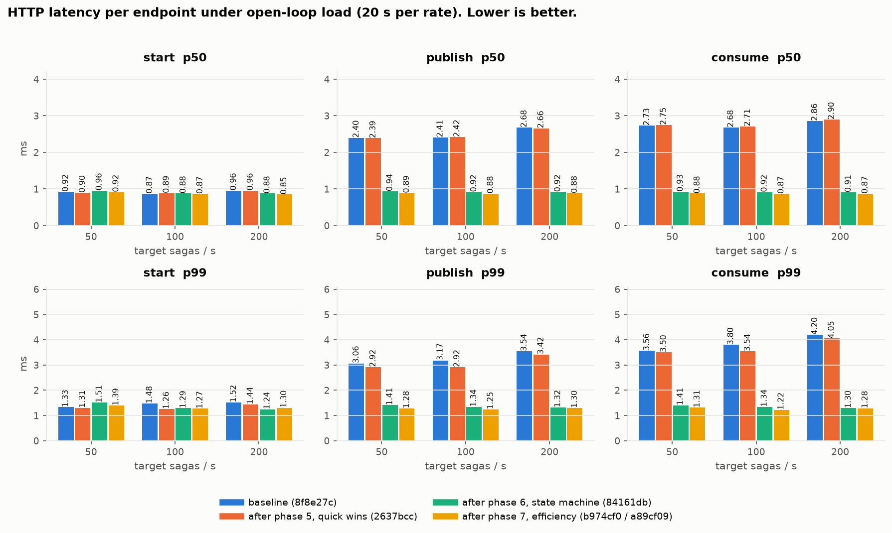
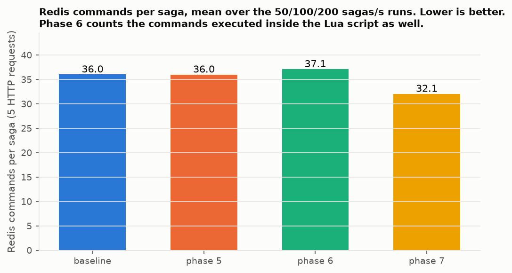
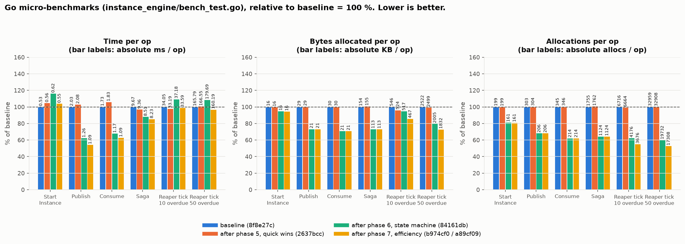
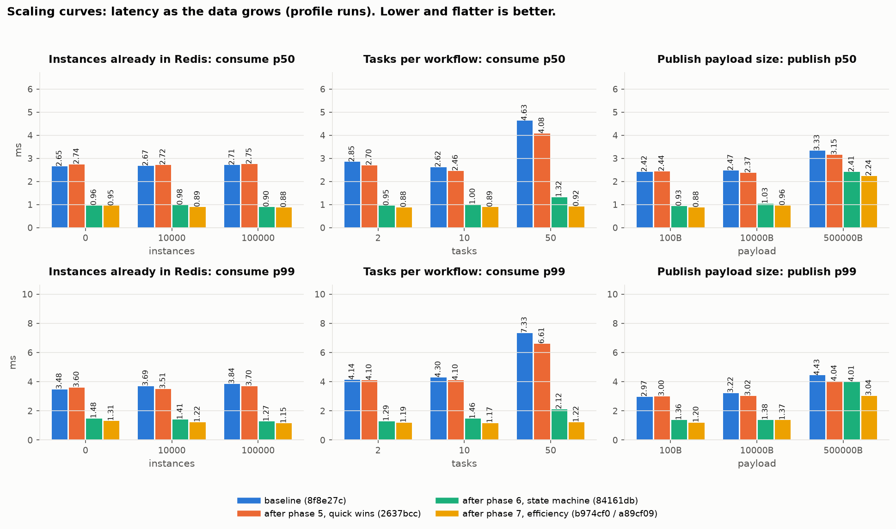

# Benchmark plots

How performance moved across the hardening phases, drawn from the run
directories in `../runs/`. Regenerate after a new `make bench` /
`make bench-profile` with:

```bash
python3 docs/benchmarks/plots/plot.py     # needs matplotlib
```

`plot.py` pins which run stands for which phase (`LOAD_RUNS`, `PROFILE_RUNS`).
Phases: **baseline** (8f8e27c, before any fix), **phase 5** (2637bcc, quick
wins), **phase 6** (84161db, state-machine rewrite), **phase 7** (b974cf0 /
a89cf09, efficiency). Every chart says "lower is better" and shows the value
on the bar, so the phase colours are never the only cue.

## 1. HTTP latency under load



Phase 5 is flat against baseline (by design). Phase 6 is the step change:
publish and consume p50 drop from ~2.4–2.9 ms to ~0.9 ms and p99 from
~3–4 ms to ~1.3 ms. Phase 7 shaves a few more percent. `start` was already
~0.9 ms and does not move.

## 2. Redis commands per saga



Phase 6 reads slightly *higher* (37 vs 36) only because the commands run
inside the Lua script are now counted. Phase 7 brings the same work down to
32 per saga (-14 %).

## 3. Saturation ramp


Baseline and phase 5 fall off a cliff past 1518 sagas/s (p99 jumps to
~500 ms at 2277). Phase 6 stays under the 50 ms SLO everywhere it was
measured but still uses 89 % of a Redis core at 2277. Phase 7 moves the knee
to 2277 sagas/s with Redis at 75 %; the breach at 3415 is the load
generator, not the server.

## 4. Redis commands per request


The per-endpoint view of what phase 7 removed: publish 7 → 6, consume
6 → 5, terminal consume 13 → 11. The phase 6 bars come from the phase 6
server re-run under the phase 7 harness (`profile-p6server-newharness`); the
original phase 6 profile's counts were polluted by queue-worker traffic.

## 5. Go micro-benchmarks



In-process cost, relative to baseline. Publish and consume time -40 to -45 %,
bytes allocated -27 %, allocations -30 to -50 %. The reaper tick got slightly
slower in phase 6 (one script call per overdue member) and recovered in
phase 7 with the batched tick; its allocations nearly halved.

## 6. Scaling curves



Latency as the data grows. Instance count (0 → 100k) never mattered. Tasks
per workflow was the bad curve: 50 tasks cost +63 % at baseline (recursive
JSONPath), +39 % after phase 6, and is flat after phase 7. A 500 KB publish
payload still costs about 2.5× a small one because the bytes travel with
the request and the script's write.

## 7. Reaper lag under simultaneous timeouts


Only the two runs on the fixed lag harness (a89cf09) are comparable; any
lag figure from an earlier run is unreliable (see `../README.md`). The
batched reaper tick cuts the worst case for 2000 simultaneous expiries from
2295 ms to 1248 ms. The 0–1000 ms band is the design floor of a once-a-second
tick.

## 8. Contention


20 concurrent reports on one instance vs 20 instances. Baseline ~13 ms p50
either way, phase 6 ~7 ms, phase 7 ~2.8 ms. Same-instance is never
meaningfully slower than separate instances, so there is no hot-key problem.
