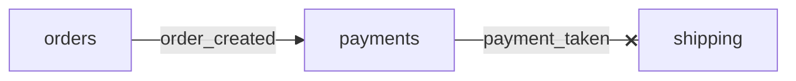
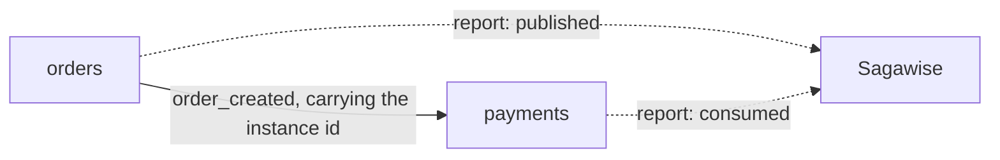

# Concepts

This document explains the problem, the vocabulary, and how the pieces of **Sagawise** fit together. The [architecture](architecture.md) page says where each idea lives; the [contract](contract.md) states the exact rules.

## The problem

An online shop is built from three **services**, each a separate program with its own database: orders saves the order, payments charges the card, shipping books the parcel. Placing one order needs all three in turn, each sending a message to the next. This chain is a **saga**, and every step has an undo, a **compensating action**: a refund undoes a charge, a cancel undoes a saved order.

In a saga ALL steps must be successfully completed. Suppose here the second message never arrives. The card is charged and nothing will ship. At this point payments should refund, but from where it stands shipping is simply quiet, and quiet could also mean slow. That is the gap Sagawise fills: it watches every step, and when one stays quiet past its time limit it tells the sender to undo its work.

## Bookkeeper, not broker

Services send their real messages over their own transport, for example Kafka. A service **publishes** a message to a **topic**; another service **consumes** it. Sagawise is not on that path. It never sees a message travel and cannot stop, delay or resend one.

Instead, each service makes a small HTTP call to Sagawise after it acts: "I published this", "I consumed this", "this failed". These calls are **reports**. They carry facts about what happened, never the message itself. Sagawise knows only what it is told, plus one thing it infers on its own: that a report which should have arrived did not.

The link between a message and its saga is an ID. The publisher puts the instance ID inside the real message; the consumer reads it back out and puts it in its own report. That is the entire connection.

Solid line: the real message, on the services' own transport. Dotted lines: the reports. Sagawise is never on the solid line.

## Describing a saga

A **workflow** is Sagawise's name for a saga. It is a short JSON file listing **tasks**. One task is one message that must travel from one service to another, and it has four fields: the topic it travels on, the service that sends it (`from`), the service that must receive it (`to`), and a **timeout** in milliseconds. A **service registry** maps each service name to a **failure URL**, the address Sagawise calls when a task that service published has failed.

An **instance** is one live run of a workflow, tracking one real saga. Every task in it starts as PENDING. A report moves a task forward; the instance itself is finished when its last task completes or its first task fails.

A publish report starts a clock for that task. A matching consume report in time stops it and the task is COMPLETED. If the clock runs out first, Sagawise marks the task FAILED, fails the instance, and calls the publisher's failure URL with the message it sent. This is the only decision Sagawise makes on its own.

Two things make the bookkeeping trustworthy. The clock is a number in Redis, so a restart loses nothing. And a late consume and the reaper can race for one task, so one Redis script does the check and the write together: exactly one wins, the other is refused.

## Two rules to know

**A publish matches by topic.** A workflow may have two tasks on the same topic with different receivers. One publish report starts both; consume and fail reports name the receiver, so each finishes on its own.

**Two time units.** Timeouts and deadlines are milliseconds. Timestamps on an instance are seconds.

## Glossary

| Term | Meaning |
| --- | --- |
| service | A separately running program with one job and its own data. |
| saga | A business action made of steps in different services, each with an undo. |
| compensating action | The undo for one step. A refund compensates a charge. |
| topic | A named channel on the services' own transport. |
| publish, consume | Send a message to a topic; read a message from it. |
| report | An HTTP call to Sagawise saying what a service just did: publish, consume or fail. |
| workflow | A saga's description: an ordered list of tasks, from a JSON file. |
| task | One message that must travel from one service to another, with a timeout. |
| instance | One live run of a workflow, tracking one real saga. |
| deadline | The moment a published task becomes overdue: publish time plus timeout. |
| reaper | The loop that fails overdue tasks. The only part of Sagawise that acts unprompted. |
| failure URL | The address Sagawise calls to tell a service that a task it published has failed. |
| PENDING, PUBLISHED, COMPLETED, FAILED | The task states: not yet sent, sent and waiting, received, given up on. An instance is PENDING, COMPLETED or FAILED. |
