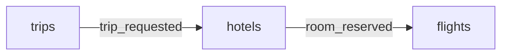

# Your first saga

Read this to learn how to use Sagawise, start to finish. You write a workflow, register a failure callback, run a saga to completion, break it twice, then see where each call goes in your own services. About twenty minutes.

You need Docker, `curl`, `python3` and a clone of the repository. Every command runs from the repository root.

The whole pipeline, which this page walks through:

1. **Describe** the saga in a workflow file.
2. **Register** a failure URL for every service that sends a message.
3. **Build and start** Sagawise, which loads both.
4. **Start an instance** each time a saga begins.
5. **Report** every publish, and every consume or fail.
6. **Compensate** when Sagawise calls a failure URL.

## The saga you will build

A trip booking. `trips` asks `hotels` to hold a room, then `hotels` asks `flights` to book a seat.



You play all three services with `curl`. There is no Kafka here: Sagawise never sees the real messages anyway, only the reports about them ([Concepts](concepts.md#bookkeeper-not-broker)).

## 1. Describe the saga

Create `backend/sagawise/trip_booking.json`:

```json
{
  "workflow": {
    "name": "trip_booking",
    "version": "1.0",
    "tasks": [
      { "topic": "trip_requested", "from": "trips",  "to": "hotels",  "timeout": 60000 },
      { "topic": "room_reserved",  "from": "hotels", "to": "flights", "timeout": 60000 }
    ]
  }
}
```

- One file per workflow, in `backend/sagawise/`. You start a workflow by its `name`.
- A task is one message: the `topic` it travels on, the service that sends it (`from`), the service that must receive it (`to`), and how long receiving may take (`timeout`, milliseconds).
- 60 seconds leaves you time to type. For real services, set it from how long the receiver can really take.
- Two tasks may share a topic if they go to different services; one publish then starts both ([Concepts](concepts.md#two-rules-to-know)).
- What makes a workflow invalid: [Contract §7](contract.md#7-startup-and-dsl-validation).

## 2. Register the failure URLs

When a task fails, Sagawise POSTs to the failure URL of the service that sent the message, so that service can undo its work. Add these two entries to the array in `services.json`:

```json
{ "service_name": "trips",  "failure_url": "http://callbacks:8000/trips" },
{ "service_name": "hotels", "failure_url": "http://callbacks:8000/hotels" }
```

- Every service that appears as `from` needs an entry, or Sagawise refuses to start. `flights` sends nothing, so it needs none.
- Sagawise calls the URL from inside its container, so use a hostname on the Docker network, never `localhost`. `callbacks` is the receiver you start in step 4.
- In a real system each service serves its own failure URL. Here one receiver stands in for both, with a path each.

## 3. Start Sagawise

```bash
make start
```

This builds the Sagawise image, with your workflow file and `services.json` copied in, and starts it on port 5000 with Redis and Postgres. The first build takes a few minutes.

Check that `trip_booking` is in the list. Every call needs an API key; `dev-api-key-change-me` is the development key from `.env`:

```bash
export SAGAWISE_URL=http://localhost:5000 KEY=dev-api-key-change-me
curl -s -H "Authorization: Bearer $KEY" "$SAGAWISE_URL/workflows/list"
```

```
["order_flow","trip_booking","user_creation"]
```

- **Changed the workflow or `services.json` after this? Run `make restart`.** Both are baked into the image; restarting the container keeps the old copy ([Configuration](configuration.md#workflow-files)).
- Nothing printed? Sagawise is still starting, or it refused to start. Retry after a few seconds. If it stays silent, `docker logs sagawise 2>&1 | grep fatal` says why: invalid JSON, a broken workflow rule, or a `from` service with no failure URL ([Start-up checks](configuration.md#start-up-checks)).
- `port is already allocated`: something else uses port 5000, 5432 or 6379. On macOS, AirPlay Receiver takes 5000.

## 4. Start the failure callback receiver

A failure callback is a plain HTTP endpoint. Sagawise POSTs the message the service sent, as JSON, and expects a 2xx answer. This one prints every call:

```bash
docker run -d --name callbacks --network shared_network python:3.12-slim python -u -c '
from http.server import BaseHTTPRequestHandler, HTTPServer

class FailureCallback(BaseHTTPRequestHandler):
    def do_POST(self):
        body = self.rfile.read(int(self.headers["Content-Length"]))
        signed = "X-Sagawise-Signature" in self.headers
        print("callback", self.path, body.decode(), "signed" if signed else "unsigned")
        self.send_response(200)
        self.end_headers()

    def log_message(self, *args):
        pass

HTTPServer(("", 8000), FailureCallback).serve_forever()
'
```

The container joins `shared_network`, the Docker network `make start` created for Sagawise, so Sagawise reaches it at `http://callbacks:8000`.

## 5. Run one saga to completion

Each block is one service doing its part. Run them in order.

**trips** begins a trip. It starts an instance, then reports that it published `trip_requested`, with the message as the body:

```bash
ID=$(curl -s -X POST -H "Authorization: Bearer $KEY" "$SAGAWISE_URL/start_instance?workflow_name=trip_booking" \
  | python3 -c 'import sys, json; print(json.load(sys.stdin)["workflow_instance_id"])')
echo "ID=$ID"
curl -s -X POST -H "Authorization: Bearer $KEY" -H "Content-Type: application/json" \
  -d '{"trip_id": 7}' \
  "$SAGAWISE_URL/update_instance?workflow_instance_id=$ID&action_type=publish&event_name=trip_requested&is_retry=false"
```

```
ID=k3Jd9sLq2mZp8xWv4bNc
{"workflow_instance_id":"k3Jd9sLq2mZp8xWv4bNc","task_index":0,"task_state":"PUBLISHED","workflow_state":"PENDING","idempotent":false}
```

The clock is running: `hotels` has 60 seconds to report. (Slower than that? Its consume is refused with a 409. Start a new trip.)

**hotels** receives the message. It reports the consume under its own name, then publishes the next message:

```bash
curl -s -X POST -H "Authorization: Bearer $KEY" \
  "$SAGAWISE_URL/update_instance?workflow_instance_id=$ID&action_type=consume&event_name=trip_requested&service_name=hotels&is_retry=false"
curl -s -X POST -H "Authorization: Bearer $KEY" -H "Content-Type: application/json" \
  -d '{"trip_id": 7, "room": 204}' \
  "$SAGAWISE_URL/update_instance?workflow_instance_id=$ID&action_type=publish&event_name=room_reserved&is_retry=false"
```

**flights** receives it and reports the consume:

```bash
curl -s -X POST -H "Authorization: Bearer $KEY" \
  "$SAGAWISE_URL/update_instance?workflow_instance_id=$ID&action_type=consume&event_name=room_reserved&service_name=flights&is_retry=false"
```

```
{"workflow_instance_id":"k3Jd9sLq2mZp8xWv4bNc","task_index":1,"task_state":"COMPLETED","workflow_state":"COMPLETED","idempotent":false}
```

The last task completed, so the saga did. Read the whole record:

```bash
curl -s -H "Authorization: Bearer $KEY" "$SAGAWISE_URL/workflow_instances/get?workflow_instance_id=$ID" | python3 -m json.tool
```

`state` is `COMPLETED` on the instance and on both tasks, and each task keeps its `payload`. A finished instance is also archived to Postgres ([Architecture](architecture.md#data)).

- `event_name` is the task's topic. `service_name`, on consume and fail, is the receiving service.
- `is_retry` is required: `false`, or `true` when you re-send a report after a network error ([Contract §4](contract.md#4-retries-and-duplicates)).
- Parameters go in the query string. The only body is the message, on `publish` ([HTTP API](api.md)).

## 6. Break it

### A message nobody receives

Start another trip, but this time `hotels` is down and never reports:

```bash
ID=$(curl -s -X POST -H "Authorization: Bearer $KEY" "$SAGAWISE_URL/start_instance?workflow_name=trip_booking" \
  | python3 -c 'import sys, json; print(json.load(sys.stdin)["workflow_instance_id"])')
echo "ID=$ID"
curl -s -X POST -H "Authorization: Bearer $KEY" -H "Content-Type: application/json" \
  -d '{"trip_id": 8}' \
  "$SAGAWISE_URL/update_instance?workflow_instance_id=$ID&action_type=publish&event_name=trip_requested&is_retry=false"
```

Wait 60 seconds, then read the receiver's log:

```bash
docker logs callbacks
```

```
callback /trips?service=hotels {"trip_id":8} signed
```

Nobody reported a failure. The deadline passed, Sagawise marked the task and the instance FAILED, and POSTed the message to `trips`, the sender, which would now cancel trip 8. `service=hotels` names the receiver that stayed silent. The call is signed because `.env` sets a webhook secret.

The saga is over. `hotels` reporting late is refused:

```bash
curl -s -X POST -H "Authorization: Bearer $KEY" \
  "$SAGAWISE_URL/update_instance?workflow_instance_id=$ID&action_type=consume&event_name=trip_requested&service_name=hotels&is_retry=false"
```

```
{"error":"TASK_ALREADY_FAILED","message":"task 0 (trip_requested → hotels) is already FAILED"}
```

### A receiver that cannot do its job

A receiver that got the message but cannot process it reports `fail` instead of `consume`. The outcome is the same, without the wait:

```bash
ID=$(curl -s -X POST -H "Authorization: Bearer $KEY" "$SAGAWISE_URL/start_instance?workflow_name=trip_booking" \
  | python3 -c 'import sys, json; print(json.load(sys.stdin)["workflow_instance_id"])')
echo "ID=$ID"
curl -s -X POST -H "Authorization: Bearer $KEY" -H "Content-Type: application/json" \
  -d '{"trip_id": 9}' \
  "$SAGAWISE_URL/update_instance?workflow_instance_id=$ID&action_type=publish&event_name=trip_requested&is_retry=false"
curl -s -X POST -H "Authorization: Bearer $KEY" \
  "$SAGAWISE_URL/update_instance?workflow_instance_id=$ID&action_type=fail&event_name=trip_requested&service_name=hotels&is_retry=false"
```

```bash
docker logs callbacks
```

```
callback /trips?service=hotels {"trip_id":8} signed
callback /trips?service=hotels {"trip_id":9} signed
```

To find failed sagas later:

```bash
curl -s -H "Authorization: Bearer $KEY" "$SAGAWISE_URL/workflow_instances/list?workflow_name=trip_booking&workflow_state=FAILED"
```

```
{"ids":["...","..."],"limit":50,"offset":0,"total":2}
```

## 7. Wire it into your services

Those calls are the whole integration. In your code they go here:

| In your service | Call |
| --- | --- |
| Where a saga begins | `start_instance`, and keep the id. |
| Just **before** sending a message | `publish`, with the message as the body. Put the instance id **inside** the message. |
| Just after receiving a message | `consume` with your own `service_name`, or `fail` if you cannot process it. |
| At your failure URL | Verify the signature, undo your work, answer 2xx. |

Easy to miss:

- **Report the publish before you send.** A consume that arrives before its publish is refused with 409 `TASK_NOT_PUBLISHED`.
- **The instance id travels in the message.** It is the only way the receiver knows which saga to report against.
- **Put in the message what the undo needs.** The failure callback carries exactly the body you published.
- **A 409 is an answer, not an outage.** A consume after a timeout gets one. Log it and move on; do not let it stop a consumer. Retry network errors and 500s, with `is_retry=true`.
- **A callback can arrive more than once.** Sagawise retries until your URL answers 2xx within 5 seconds, for about 15 minutes. Make the undo idempotent, and verify the signature so nobody else can trigger it ([The failure webhook](api.md#the-failure-webhook)).
- **Every silence counts against the timeout.** A receiver that is restarting, or a Kafka consumer still joining its group, looks the same as a lost message.
- **Workflow and `services.json` changes need a rebuild.** Running instances keep the tasks they started with.

Code to start from:

- The [Node](https://github.com/venturenox/sagawise/tree/main/sdk/nodejs) and [Python](https://github.com/venturenox/sagawise/tree/main/sdk/python) SDKs wrap these calls and include `verify_signature`. They are not on npm or PyPI yet.
- [`examples/order_flow`](https://github.com/venturenox/sagawise/tree/main/examples/order_flow) is this pattern in three small Node services over Kafka, with every Sagawise call in one short `sagawiseClient.js`. Run it with `make order_flow` and follow its README.

## 8. Clean up

```bash
docker rm -f callbacks
make clean
```

`make clean` removes the containers, their data, the images and the network. To drop the tutorial saga from the repository too, delete `backend/sagawise/trip_booking.json` and the two entries you added to `services.json`.

## Next

- [Concepts](concepts.md): why it works this way, and the vocabulary.
- [HTTP API](api.md): every endpoint, parameter, response and error code.
- [Contract](contract.md): the exact state machine, retry rules and timing.
- Before deploying: your workflow files and `services.json` ship inside the image, so you build your own ([Configuration](configuration.md#workflow-files)). Set your own API keys and webhook secret ([Security](security.md)), and read [Operations](operations.md) for running it.
